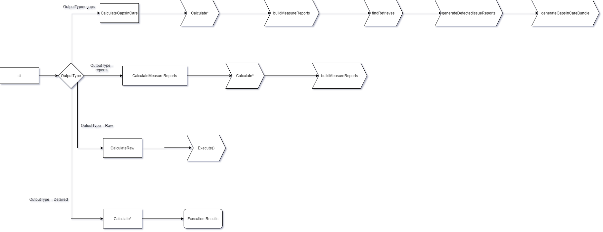

# FHIR Quality Measure Execution and Highlighting

Library for executing FHIR-based Electronic Clinical Quality Measures (eCQMs) written in Clinical Quality Language (CQL)

- [Installation](#installation)

- [Usage](#usage)

  - [Module](#module)
  - [Calculation Options](#calculation-options)
  - [CLI](#cli)
  - [TypeScript](#typescript)

- [Local Development](#local-development)

  - [Prerequisites](#prerequisites)
  - [Local Installation/Usage](#local-installation%2Fusage)
  - [Debugging in VS Code](#debugging-in-vs-code)
  - [Testing](#testing)
  - [Checks](#checks)

- [License](#license)

## Installation

`fqm-execution` can be installed into your project with npm:

```bash
npm install --save fqm-execution
```

To install the global command line interface (CLI), use npm global installation:

```bash
npm install -g fqm-execution
```

## Usage

### Module

#### ES6

```JavaScript
import { Calculator } from 'fqm-execution';

const rawResults = await Calculator.calculateRaw(measureBundle, patientBundles, options, valueSetCache); // Get raw results from CQL engine for each patient
const detailedResults = await Calculator.calculate(measureBundle, patientBundles, options, valueSetCache); // Get detailed population results for each patient
const measureReports = await Calculator.calculateMeasureReports(measureBundle, patientBundles, options, valueSetCache); // Get individual FHIR MeasureReports for each patient
const measureReports = await Calculator.calculateMeasureReports(measureBundle, [], options, valueSetCache); // Get individual FHIR MeasureReports for each patient given a custom patientSource in the options object
const gapsInCare = await Calculator.calculateGapsInCare(measureBundle, patientBundles, options, valueSetCache); // Get gaps in care for each patient, if present
const dataRequirements = Calculator.calculateDataRequirements(measureBundle); // Get data requirements for a given measure (in a bundle)
const queryInfo = Calculator.calculateQueryInfo(measureBundle); // Get detailed query info for all statements in a measure
```

#### Require

```JavaScript
const { Calculator } = require('fqm-execution');

const rawResults = await Calculator.calculateRaw(measureBundle, patientBundles, options, valueSetCache); // Get raw results from CQL engine for each patient
const detailedResults = await Calculator.calculate(measureBundle, patientBundles, options, valueSetCache); // Get detailed population results for each patient
const measureReports = await Calculator.calculateMeasureReports(measureBundle, patientBundles, options, valueSetCache); // Get individual FHIR MeasureReports for each patient
const measureReports = await Calculator.calculateMeasureReports(measureBundle, [], options, valueSetCache); // Get individual FHIR MeasureReports for each patient given a custom patientSource in the options object
const gapsInCare = await Calculator.calculateGapsInCare(measureBundle, patientBundles, options, valueSetCache); // Get gaps in care for each patient, if present
const dataRequirements = Calculator.calculateDataRequirements(measureBundle); // Get data requirements for a given measure (in a bundle)
const queryInfo = Calculator.calculateQueryInfo(measureBundle); // Get detailed query info for all statements in a measure
```

#### Arguments

- `measureBundle`: Bundle containing a FHIR Measure and its dependent Libraries. FHIR ValueSets may be included as well
- `patientBundles`: Array of FHIR Bundles containing patient data
- `options` (optional): Object of calculation options (see below)
- `valueSetCache` (optional): Array of FHIR ValueSet resources to use for calculation

#### Calculation Options

The options that we support for calculation are as follows:
| option | type | optional? | description |
| :--------------------- | :-----: | :-------: | :--------------------------------------------------------------------------------- |
| enableDebugOutput | boolean | yes | Enable debug output from function calls. Defaults to false. |
| includeClauseResults | boolean | yes | Option to include clause results. Defaults to false. |
| includePrettyResults | boolean | yes | Option to include pretty results on statement results. Defaults to false. |
| includeHighlighting | boolean | yes | Include highlighting in MeasureReport narrative. Defaults to false. |
| measurementPeriodStart | string | yes | Start of measurement period. |
| measurementPeriodEnd | string | yes | End of measurement period. |
| patientSource | DataProvider | yes | PatientSource to use. If provided, the patientBundles will not be required. The PatientSource/DataProvider interface is defined in TypeScript by [cql-execution](https://github.com/cqframework/cql-execution/blob/master/src/types/cql-patient.interfaces.ts). |
| reportType | string | yes | Type of MeasureReport to generate: "summary" or "individual". |
| calculateSDEs | boolean | yes | Include Supplemental Data Elements in calculation. Defaults to false. |
| calculateHTML | boolean | yes | Include HTML structure for highlighting. Defaults to false. |
| vsAPIKey | string | yes | API key, to be used to access a valueset API for downloading any missing valuesets |
| useValueSetCaching | boolean | yes | Whether to cache valuesets obtained by an API on the filesystem |

### CLI

To run the globally installed CLI (see above), use the global `fqm-execution command`

```bash
Usage: fqm-execution [options]

Options:
  -d, --debug                                 enable debug output (default: false)
  -o, --output-type <type>                    type of output, "raw", "detailed", "reports", "gaps", "dataRequirements", "queryInfo" (default: "detailed")
  -r, --report-type <report-type>             type of report, "individual", "summary", "subject-list"
  -m, --measure-bundle <measure-bundle>       path to measure bundle
  -p, --patient-bundles <patient-bundles...>  paths to patient bundles. Required unless output type is dataRequirements
  -f, --as-patient-source                     Load bundles by creating cql-exec-fhir PatientSource to pass into library calls
  -s, --measurement-period-start <date>       start date for the measurement period, in YYYY-MM-DD format (defaults to the start date defined in the Measure, or 2019-01-01 if not set
                                              there)
  -e, --measurement-period-end <date>         end date for the measurement period, in YYYY-MM-DD format (defaults to the end date defined in the Measure, or 2019-12-31 if not set there)
  -a, --vs-api-key <key>                      API key, to authenticate against the valueset service to be used for resolving missing valuesets
  -c, --cache-valuesets                       Whether or not to cache ValueSets retrieved from the ValueSet service (default: false)
  -h, --help                                  display help for command
```

E.g.

```bash
fqm-execution -o reports -m /path/to/measure/bundle.json -p /path/to/patient1/bundle.json > reports.json
```

### ValueSets

If the Measure bundle provided doesn't contain all the required `ValueSet` resources (with expansions or composes) to calculate the measure, an API key can be provided to resolve the valuesets from their provided URLs. Currently only tested with valuesets from [The NLM FHIR Valueset API](https://cts.nlm.nih.gov/fhir).

To find your VSAC API key, sign into [the UTS homepage](https://uts.nlm.nih.gov/uts/), click on `My Profile` in the top right, and copy the `API KEY` value from the `UMLS Licensee Profile`.

### TypeScript

`fqm-execution` exports custom-defined TypeScript interfaces used within the code to allow for easy integration into other TypeScript projects. The TypeScript files defining these interfaces can be found [here](https://github.com/projecttacoma/fqm-execution/tree/master/src/types)

## Local Development

### Prerequisites

- [Node.js >=10.15.1](https://nodejs.org/en/)
- [Git](https://git-scm.com/)

### Local Installation/Usage

Clone the source code:

```bash
git clone https://github.com/projecttacoma/fqm-execution.git
```

Install dependencies:

```bash
npm install
```

Optionally, you can install the `ts-node` utility globally to execute the TypeScript files directly instead of running the build script:

```bash
npm install -g ts-node
```

Run the CLI with ts-node:

```bash
ts-node --files src/cli.ts [options]
```

Or using the built JavaScript:

```bash
npm run build
node build/cli.js [options]
```

### Debug Option

The CLI comes built with a debug option (`-d/--debug`) which will include a `debugOutput` property on the results object containing any CQL, ELM, ValueSets, and engine results processed during execution.

### Debugging in VS Code

To attach a debugger to the TypeScript files for deeper inspection of the tool's functionality, we recommend using the [VS Code text editor](https://code.visualstudio.com/) to be able to provide easy debugger configuration.

Add the following contents to `.vscode/launch.json` in the root of the project directory:

```JavaScript
{
    // Use IntelliSense to learn about possible attributes.
    // Hover to view descriptions of existing attributes.
    // For more information, visit: https://go.microsoft.com/fwlink/?linkid=830387
    "version": "0.2.0",
    "configurations": [
        {
            "type": "node",
            "request": "launch",
            "name": "Launch Program",
            "skipFiles": [
              "<node_internals>/**"
            ],
            "preLaunchTask": "npm: build",
            "program": "${workspaceFolder}/src/cli.ts",
            "outFiles": [
              "${workspaceFolder}/build/**/*.js"
            ],
            "internalConsoleOptions": "openOnSessionStart",
            "args": ["-m", "${workspaceFolder}/relative/path/to/measure/bundle.json", "-p", "${workspaceFolder}/relative/path/to/patient/bundle.json", "-o", "<reports | detailed | raw | gaps>"]
          }
    ]
}

```

This will allow you to run the CLI from the `Run` tab in VS Code, and will halt execution of the program at any breakpoints or `debugger` statements in the code, to allow for debugging of the functionality.

### Testing

We use [Jest](https://jestjs.io/en/) for unit-testing `fqm-execution`. Tests can be running using the `test` script in package.json:

```bash
npm test
```

### Checks

When contributing new code, ensure that all tests, lint, and prettier checks pass with the following command:

```bash
npm run check
```

### Architecture Overview



A visual representation of the calculate sequence of the application can be seen below:


## License

Copyright 2020 The MITRE Corporation

Licensed under the Apache License, Version 2.0 (the "License"); you may not use this file except in compliance with the License. You may obtain a copy of the License at

```bash
http://www.apache.org/licenses/LICENSE-2.0
```

Unless required by applicable law or agreed to in writing, software distributed under the License is distributed on an "AS IS" BASIS, WITHOUT WARRANTIES OR CONDITIONS OF ANY KIND, either express or implied. See the License for the specific language governing permissions and limitations under the License.
