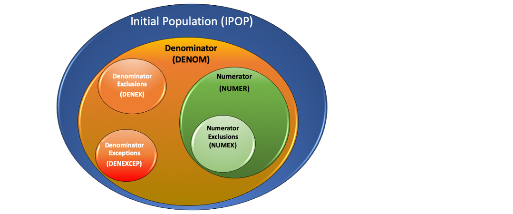

<p align="center">
  <h1 align="center">fqm-execution</h1>
<div align="center">

Library for calculating Electronic Clinical Quality Measures (eCQMs) written in Clinical Quality Language (CQL) using the HL7® FHIR® standard<sup id="fn-1">[\[1\]](#fnref-1)</sup>

</div>
</p>
<div align="center">
  <a href="https://projecttacoma.github.io/fqm-execution">docs</a>
  <span>&nbsp;&nbsp;•&nbsp;&nbsp;</span>
  <a href="https://www.npmjs.com/package/fqm-execution">npm</a>
  <span>&nbsp;&nbsp;•&nbsp;&nbsp;</span>
  <a href="https://github.com/projecttacoma/fqm-execution">github</a>
  <br />
</div>

---

# Table of Contents

- [Table of Contents](#table-of-contents)
- [Introduction](#introduction)
- [Installation](#installation)
- [Usage](#usage)
  - [Quickstart](#quickstart)
  - [Requirements](#requirements)
  - [Calculating an eCQM](#calculating-an-ecqm)
    - [Statement Results](#statement-results)
  - [Interpreting Calculation Results](#interpreting-calculation-results)
    - [Boolean Measures](#boolean-measures)
    - [Episode-based Measures](#episode-based-measures)
- [Other Calculation Capabilities](#other-calculation-capabilities)
  - [Gaps in Care](#gaps-in-care)
  - [Data Requirements](#data-requirements)
  - [Query Info](#query-info)
- [API Reference](#api-reference)
  - [Calculator Functions](#calculator-functions)
    - [`.calculate`](#calculate)
    - [`.calculateDataRequirements`](#calculatedatarequirements)
    - [`.calculateGapsInCare`](#calculategapsincare)
    - [`.calculateLibraryDataRequirements`](#calculatelibrarydatarequirements)
    - [`.calculateMeasureReports`](#calculatemeasurereports)
    - [`.calculateQueryInfo`](#calculatequeryinfo)
    - [`.calculateRaw`](#calculateraw)
  - [Measure Bundle Helpers](#measure-bundle-helpers)
    - [`.addValueSetsToMeasureBundle`](#addvaluesetstomeasurebundle)
  - [Calculation Options](#calculation-options)
  - [CLI](#cli)
- [Guides and Concepts](#guides-and-concepts)
  - [Stratification](#stratification)
  - [Measures with Observation Functions](#measures-with-observation-functions)
  - [`meta.profile` Checking](#metaprofile-checking)
  - [Supplemental Data Elements and Risk Adjustment Variables](#supplemental-data-elements-and-risk-adjustment-variables)
  - [Composite Measures](#composite-measures)
  - [Slim Calculation Mode](#slim-calculation-mode)
  - [Measure Logic Highlighting](#measure-logic-highlighting)
    - [Population Relevance for Highlighting](#population-relevance-for-highlighting)
    - [CQL Statement Ordering in HTML](#cql-statement-ordering-in-html)
    - [Statement-level HTML](#statement-level-html)
  - [Group Clause Coverage Highlighting](#group-clause-coverage-highlighting)
    - [Uncoverage Highlighting](#uncoverage-highlighting)
    - [Coverage Details](#coverage-details)
    - [Clause Coverage of Null and False Literal Values](#clause-coverage-of-null-and-false-literal-values)
    - [Visual Issues with Coverage Highlighting](#visual-issues-with-coverage-highlighting)
  - [ValueSet Resolution](#valueset-resolution)
  - [Custom PatientSource](#custom-patientsource)
  - [Usage with TypeScript](#usage-with-typescript)
    - [DEPRECATION NOTICE](#deprecation-notice)
- [Recipes](#recipes)
  - [Displaying Highlighted HTML in a React App](#displaying-highlighted-html-in-a-react-app)
  - [Usage Within a FHIR Server](#usage-within-a-fhir-server)
  - [Special Testing](#special-testing)
    - [Regression Testing](#regression-testing)
    - [Data Requirements Testing](#data-requirements-testing)
- [Contributing](#contributing)
- [License](#license)

# Introduction

`fqm-execution` is a library for calculating FHIR-based Electronic Clinical Quality Measures (eCQMs) written in Clinical Quality Language (CQL). It wraps the [cql-execution](https://github.com/cqframework/cql-execution) and [cql-exec-fhir](https://github.com/cqframework/cql-exec-fhir/)
libraries in order to provide eCQM-specific output/interpretation of the raw results returned from executing the CQL/ELM on provided patient data.

More information about FHIR eCQMs can be found in the [FHIR Quality Measure Implementation Guide](https://build.fhir.org/ig/HL7/cqf-measures/index.html), which informs the majority of how `fqm-execution` calculation behaves.

# Installation

`fqm-execution` can be installed into your project with [npm](https://www.npmjs.com/package/fqm-execution):

```bash
npm install --save fqm-execution
```

To install the global command line interface (CLI), use npm global installation:

```bash
npm install -g fqm-execution
```

# Usage

## Quickstart

```typescript
import { Calculator } from 'fqm-execution';

// ...

const { results } = await Calculator.calculate(measureBundle, patientBundles, options[, valueSetCache]);

// ...
```

## Requirements

To calculate a FHIR-based eCQM, `fqm-execution` needs the following information:

- A [FHIR Bundle](http://hl7.org/fhir/bundle.html) resource that contains:
  - One [FHIR Measure](https://build.fhir.org/ig/HL7/cqf-measures/StructureDefinition-measure-cqfm.html) resource containing the metadata for the measure
  - The [FHIR Library](https://build.fhir.org/ig/HL7/cqf-measures/StructureDefinition-library-cqfm.html) resource that is referenced from the above `Measure` resource's `.library` property, and any other FHIR `Library` resources that are dependencies of the main measure logic (e.g. `FHIRHelpers`)
    - **NOTE**: These `Library` resources _must_ contain `base64`-encoded ELM JSON content directly on the resource. `fqm-execution` does not do any real-time translation of CQL to ELM
  - Any [FHIR ValueSet](http://hl7.org/fhir/valueset.html) resources that are used in the measure logic\*
- One or more FHIR `Bundle` resources\*\* that contain:
  - One [FHIR Patient](http://hl7.org/fhir/patient.html) resource
  - Any other FHIR resources that contain relevant data for the above patient that should be considered during measure calculation

\*`ValueSet` resources can be omitted if you follow the approach outlined in the [ValueSet Resolution](#valueset-resolution) section

\*\*A patient `Bundle` may not be required in all types of calculation, such as [data requirements](#data-requirements) or [query info](#query-info) calculation

## Calculating an eCQM

`fqm-execution` exports the `Calculator` object, which contains an API function that returns eCQM calculation results as a detailed object containing calculation results for each patient across all population groups defined in `Measure` resource:

```typescript
import { Calculator } from 'fqm-execution';

// ...

const { results } = await Calculator.calculate(measureBundle, patientBundles, options[, valueSetCache]);
```

The calculation results returned above will have the following structure:

```
[
  {
    "patientId": "<some-patient-id>",
    "detailedResults": [
      {
        "groupId": "<some-group-id>",
        "statementResults": [<raw results of each root CQL statement from the engine>],
        "populationResults": [<results for inclusion in each eCQM population for this patient>],
        "populationRelevance": [<list of which populations were considered for inclusion for this patient>],
        "clauseResults": [<specific clause-level results of each snippet of CQL>],
        "html": "<html markup of logic highlighting>"
      }
    ],
    "evaluatedResource": [<resources processed by the engine during execution of this patient>],
    "patientObject": {<JSON of the patient resource for easier access to properties of this patient>},
    "supplementalData": [<results of supplemental data element calculation for this patient>"]
  }
]
```

### Statement Results

Statement results are a part of the calculation's `detailedResults` data. Statement results can be used to inspect the individual results of each CQL statement found in the measure CQL. Statement results will have the following structure:

```
{
  "libraryName": <name of library statement is found in>,
  "statementName": <name of CQL statement>,
  "localId": <id for internal calculation reference>,
  "final": <'NA', 'UNHIT', 'TRUE', or 'FALSE'>,
  "relevance": <whether the statement impacted the calculation>,
  "raw": <raw result of the statement calculation>,
  "isFunction": <whether the statement is a function>,
  "pretty": <human readable version of the raw result>,
  "statementLevelHTML": <Generated HTML markup for the CQL statement>
}
```

The statement result `.pretty` attribute can be used to show results data in a more user-friendly way for any of the calculated statements. The statement result `.statementLevelHTML` attribute can be used to build the HTML markup alongside the "pretty" formatted statements without having to do so on the entire HTML output.

## Interpreting Calculation Results

### Boolean Measures

For most cases, the desired property for interpreting the results object returned by `Calculator.calculate` is the `detailedResults[x].populationResults` array, which contains results for whether or not the patient landed in each eCQM population defined by the `Measure` resource.

For example, if the `Measure` resource defines the populations for `"Initial Population"`, `"Numerator"`, and `"Denominator"` in group `"group-1"`, and the patient with ID `"patient-1"` calculates into the numerator population, the detailed results might look as follows:

```typescript
[
  {
    patientId: 'patient-1',
    detailedResults: [
      {
        groupId: 'group-1',
        populationResults: [
          {
            populationType: 'initial-population',
            criteriaExpression: 'Initial Population',
            result: true
          },
          {
            populationType: 'denominator',
            criteriaExpression: 'Denominator',
            result: true
          },
          {
            populationType: 'numerator',
            criteriaExpression: 'Numerator',
            result: true
          }
        ]
        // ...
      }
      // ...
    ]
    // ...
  }
];
```

These results are assembled according to the various [Measure Population Semantics](https://build.fhir.org/ig/HL7/cqf-measures/measure-conformance.html#measure-population-semantics) defined in the FHIR Quality Measure Implementation Guide, meaning that dependencies of the various eCQM populations are factored in
during the results processing (e.g. a patient cannot be in the numerator if they are not in the denominator).

### Episode-based Measures

For episode-based measures, calculation is largely the same as the [basic example](#interpreting-calculation-results), but the detailed results responses allow for a more granular view of which populations each individual episode landed into via an `episodeResults` list that appears in each
`detailedResult` object for episode-based measures only.

In this case, there is still an overall `populationResults` list for convenience, where a given `populationResult` is `true` if _any_ of the episodes have result `true` for that population in the individual `episodeResults` list. Continuing the example from above, the following would be what the results
might look like for `patient-1` where they have two episodes, one that calculates into the numerator (`"episode-1"`), and another that only calculates into the initial population (`"episode-2"`):

```typescript
[
  {
    patientId: 'patient-1',
    detailedResults: [
      {
        groupId: 'group-1',
        populationResults: [
          {
            populationType: 'initial-population',
            criteriaExpression: 'Initial Population',
            result: true
          },
          {
            populationType: 'denominator',
            criteriaExpression: 'Denominator',
            result: true
          },
          {
            populationType: 'numerator',
            criteriaExpression: 'Numerator',
            result: true
          }
        ],
        episodeResults: [
          {
            episodeId: 'episode-1',
            populationResults: [
              {
                populationType: 'initial-population',
                criteriaExpression: 'Initial Population',
                result: true
              },
              {
                populationType: 'denominator',
                criteriaExpression: 'Denominator',
                result: true
              },
              {
                populationType: 'numerator',
                criteriaExpression: 'Numerator',
                result: true
              }
            ]
          },
          {
            episodeId: 'episode-2',
            populationResults: [
              {
                populationType: 'initial-population',
                criteriaExpression: 'Initial Population',
                result: true
              },
              {
                populationType: 'denominator',
                criteriaExpression: 'Denominator',
                result: false
              },
              {
                populationType: 'numerator',
                criteriaExpression: 'Numerator',
                result: false
              }
            ]
          }
        ]
        // ...
      }
      // ...
    ]
    // ...
  }
  // ...
];
```

Note that in the above example, the overall `populationResults` list has `true` for each population because `episode-1` is included in all of them, regardless of the fact that `episode-2` is not.

# Other Calculation Capabilities

Beyond just calculation of eCQM results, the `fqm-execution` `Calculator` has other API functions for doing various types of analysis on a measure.

## Gaps in Care

A detailed overview of Gaps in Care can be seen in the [DEQM Implementation Guide](https://build.fhir.org/ig/HL7/davinci-deqm/gaps-examples.html) and the [fqm-execution Wiki page](https://github.com/projecttacoma/fqm-execution/wiki/Gaps-In-Care).

In short, Gaps in Care is a means of identifying detailed reasons why patients may not have calculated into the "desired" population for a measure (e.g. the numerator population in most positive improvement measures). `fqm-execution` can produce [DEQM Gaps in Care Bundles](https://build.fhir.org/ig/HL7/davinci-deqm/StructureDefinition-gaps-bundle-deqm.html)
via the [`.calculateGapsInCare`](#calculategapsincare) API function.

## Data Requirements

`fqm-execution` provides the capability to analyze the "Data Requirements" of a measure. This ultimately boils down to:

- What FHIR datatypes are queried for by any statement in the main measure logic and dependent libraries
- What ValueSets are those datatypes restricted to, if any
- Any additional information about filters done on the FHIR resources within a query (e.g. restricting date attributes to a specific range, having a fixed value on one of the attributes, etc.)

Analysis of Data Requirements can be done via the [`.calculateDataRequirements`](#calculatedatarequirements) API function.

## Query Info

`fqm-execution` can analyze the "Query Info" of a measure, which is referring to the low-level filter information that is done in the `where` clauses of CQL queries that exist in the measure logic. The most common use case for this is when you want to try to get a sense for all of the attributes that are accessed/filtered on
across various pieces of measure logic.

Analysis of Query Info can be done via the [`.calculateQueryInfo`](#calculatequeryinfo) API function.

# API Reference

## Calculator Functions

```typescript
import { Calculator } from 'fqm-execution';
```

### `.calculate`

Get detailed population results for each patient.

**Parameters**:

- `measureBundle` <[fhir4.Bundle](https://github.com/DefinitelyTyped/DefinitelyTyped/blob/5f88f0c7a11e86a19fc2356d0e11dfa7f472e3c9/types/fhir/r4.d.ts#L4325)>
- `patientBundles` <[fhir4.Bundle[]](https://github.com/DefinitelyTyped/DefinitelyTyped/blob/5f88f0c7a11e86a19fc2356d0e11dfa7f472e3c9/types/fhir/r4.d.ts#L4325)>
- `options` <[CalculatorTypes.CalculationOptions](https://github.com/projecttacoma/fqm-execution/blob/7c43b94521963703bdb43932bad60e5be3e7eeaa/src/types/Calculator.ts#L12)>
- `[valueSetCache]` <[fhir4.ValueSet[]](https://github.com/DefinitelyTyped/DefinitelyTyped/blob/5f88f0c7a11e86a19fc2356d0e11dfa7f472e3c9/types/fhir/r4.d.ts#L28217)>

**Returns**:

[Promise<CalculatorTypes.CalculationOutput>](https://github.com/projecttacoma/fqm-execution/blob/7c43b94521963703bdb43932bad60e5be3e7eeaa/src/types/Calculator.ts#L357)

### `.calculateDataRequirements`

Get data requirements for a given Measure.

**Parameters**:

- `measureBundle` <[fhir4.Bundle](https://github.com/DefinitelyTyped/DefinitelyTyped/blob/5f88f0c7a11e86a19fc2356d0e11dfa7f472e3c9/types/fhir/r4.d.ts#L4325)>
- `[options]` <[CalculatorTypes.CalculationOptions](https://github.com/projecttacoma/fqm-execution/blob/7c43b94521963703bdb43932bad60e5be3e7eeaa/src/types/Calculator.ts#L12)>

**Returns**:

[Promise<CalculatorTypes.DRCalculationOutput>](https://github.com/projecttacoma/fqm-execution/blob/7c43b94521963703bdb43932bad60e5be3e7eeaa/src/types/Calculator.ts#L421)

### `.calculateGapsInCare`

Get gaps in care for each patient. Output adheres to the [DEQM Gaps In Care Bundle Profile](https://build.fhir.org/ig/HL7/davinci-deqm/StructureDefinition-gaps-bundle-deqm.html).

**Parameters**:

- `measureBundle` <[fhir4.Bundle](https://github.com/DefinitelyTyped/DefinitelyTyped/blob/5f88f0c7a11e86a19fc2356d0e11dfa7f472e3c9/types/fhir/r4.d.ts#L4325)>
- `patientBundles` <[fhir4.Bundle[]](https://github.com/DefinitelyTyped/DefinitelyTyped/blob/5f88f0c7a11e86a19fc2356d0e11dfa7f472e3c9/types/fhir/r4.d.ts#L4325)>
- `options` <[CalculatorTypes.CalculationOptions](https://github.com/projecttacoma/fqm-execution/blob/7c43b94521963703bdb43932bad60e5be3e7eeaa/src/types/Calculator.ts#L12)>
- `[valueSetCache]` <[fhir4.ValueSet[]](https://github.com/DefinitelyTyped/DefinitelyTyped/blob/5f88f0c7a11e86a19fc2356d0e11dfa7f472e3c9/types/fhir/r4.d.ts#L28217)>

**Returns**:

[Promise<CalculatorTypes.GICCalculationOutput>](https://github.com/projecttacoma/fqm-execution/blob/7c43b94521963703bdb43932bad60e5be3e7eeaa/src/types/Calculator.ts#L397)

### `.calculateLibraryDataRequirements`

Get data requirements for a given Library bundle with a root Library reference.

**Parameters**:

- `libraryBundle` <[fhir4.Bundle](https://github.com/DefinitelyTyped/DefinitelyTyped/blob/5f88f0c7a11e86a19fc2356d0e11dfa7f472e3c9/types/fhir/r4.d.ts#L4325)>
- `[options]` <[CalculatorTypes.CalculationOptions](https://github.com/projecttacoma/fqm-execution/blob/7c43b94521963703bdb43932bad60e5be3e7eeaa/src/types/Calculator.ts#L12)>
  - Note: `measurementPeriodStart`/`measurementPeriodEnd` are omitted from library data requirements calculation if provided.

**Returns**:

[Promise<CalculatorTypes.DRCalculationOutput>](https://github.com/projecttacoma/fqm-execution/blob/7c43b94521963703bdb43932bad60e5be3e7eeaa/src/types/Calculator.ts#L421)

### `.calculateMeasureReports`

Get individual FHIR MeasureReports for each patient, or a summary report for an entire set of patients.

**Parameters**:

- `measureBundle` <[fhir4.Bundle](https://github.com/DefinitelyTyped/DefinitelyTyped/blob/5f88f0c7a11e86a19fc2356d0e11dfa7f472e3c9/types/fhir/r4.d.ts#L4325)>
- `patientBundles` <[fhir4.Bundle[]](https://github.com/DefinitelyTyped/DefinitelyTyped/blob/5f88f0c7a11e86a19fc2356d0e11dfa7f472e3c9/types/fhir/r4.d.ts#L4325)>
- `options` <[CalculatorTypes.CalculationOptions](https://github.com/projecttacoma/fqm-execution/blob/7c43b94521963703bdb43932bad60e5be3e7eeaa/src/types/Calculator.ts#L12)>
- `[valueSetCache]` <[fhir4.ValueSet[]](https://github.com/DefinitelyTyped/DefinitelyTyped/blob/5f88f0c7a11e86a19fc2356d0e11dfa7f472e3c9/types/fhir/r4.d.ts#L28217)>

**Returns**:

[Promise<CalculatorTypes.MRCalculationOutput>](https://github.com/projecttacoma/fqm-execution/blob/7c43b94521963703bdb43932bad60e5be3e7eeaa/src/types/Calculator.ts#L369)

### `.calculateQueryInfo`

Get detailed query info for all statements in a measure.

**Parameters**:

- `measureBundle` <[fhir4.Bundle](https://github.com/DefinitelyTyped/DefinitelyTyped/blob/5f88f0c7a11e86a19fc2356d0e11dfa7f472e3c9/types/fhir/r4.d.ts#L4325)>
- `[options]` <[CalculatorTypes.CalculationOptions](https://github.com/projecttacoma/fqm-execution/blob/7c43b94521963703bdb43932bad60e5be3e7eeaa/src/types/Calculator.ts#L12)>

**Returns**:

[Promise<CalculatorTypes.QICalculationOutput>](https://github.com/projecttacoma/fqm-execution/blob/7c43b94521963703bdb43932bad60e5be3e7eeaa/src/types/Calculator.ts#L428)

### `.calculateRaw`

Get raw results from CQL engine for each patient.

**Parameters**:

- `measureBundle` <[fhir4.Bundle](https://github.com/DefinitelyTyped/DefinitelyTyped/blob/5f88f0c7a11e86a19fc2356d0e11dfa7f472e3c9/types/fhir/r4.d.ts#L4325)>
- `patientBundles` <[fhir4.Bundle[]](https://github.com/DefinitelyTyped/DefinitelyTyped/blob/5f88f0c7a11e86a19fc2356d0e11dfa7f472e3c9/types/fhir/r4.d.ts#L4325)>
- `options` <[CalculatorTypes.CalculationOptions](https://github.com/projecttacoma/fqm-execution/blob/7c43b94521963703bdb43932bad60e5be3e7eeaa/src/types/Calculator.ts#L12)>
- `[valueSetCache]` <[fhir4.ValueSet[]](https://github.com/DefinitelyTyped/DefinitelyTyped/blob/5f88f0c7a11e86a19fc2356d0e11dfa7f472e3c9/types/fhir/r4.d.ts#L28217)>

**Returns**:

[Promise<CalculatorTypes.RCalculationOutput>](https://github.com/projecttacoma/fqm-execution/blob/7c43b94521963703bdb43932bad60e5be3e7eeaa/src/types/Calculator.ts#L390)

## Measure Bundle Helpers

```typescript
import { MeasureBundleHelpers } from 'fqm-execution';
```

### `.addValueSetsToMeasureBundle`

Add missing ValueSet resources to a measure bundle.

**Parameters**:

- `measureBundle` <[fhir4.Bundle](https://github.com/DefinitelyTyped/DefinitelyTyped/blob/5f88f0c7a11e86a19fc2356d0e11dfa7f472e3c9/types/fhir/r4.d.ts#L4325)>
- `options` <[CalculatorTypes.CalculationOptions](https://github.com/projecttacoma/fqm-execution/blob/7c43b94521963703bdb43932bad60e5be3e7eeaa/src/types/Calculator.ts#L12)>

**Returns**:

[Promise<CalculatorTypes.ValueSetOutput>](https://github.com/projecttacoma/fqm-execution/blob/7c43b94521963703bdb43932bad60e5be3e7eeaa/src/types/Calculator.ts#L404)

## Calculation Options

The options that we support for calculation are as follows:

- `[buildStatementLevelHTML]`<[boolean](#calculation-options)>: Builds and returns HTML at the statement level (default: `false`)
- `[calculateClauseCoverage]`<[boolean](#calculation-options)>: Include HTML structure with clause coverage highlighting (default: `true`)
- `[calculateClauseUncoverage]`<[boolean](#calculation-options)>: Include HTML structure with clause uncoverage highlighting (default: `false`)
- `[calculateCoverageDetails]`<[boolean](#calculation-options)>: Include details on logic clause coverage. (default: `false`)
- `[calculateHTML]`<[boolean](#calculation-options)>: Include HTML structure for highlighting (default: `true`)
- `[calculateSDEs]`<[boolean](#calculation-options)>: Include Supplemental Data Elements (SDEs) in calculation (default: `true`)
- `[calculateRAVs]`<[boolean](#calculation-options)>: Include Risk Adjustment Variables (RAVs) in calculation (default: `true`)
- `[clearElmJsonsCache]`<[boolean](#calculation-options)>: If `true`, clears ELM JSON cache before running calculation (default: `false`)
- `[disableHTMLOrdering]`<[boolean](#calculation-options)>: Disables custom ordering of CQL statements in HTML output (default: `false`)
- `[enableDebugOutput]`<[boolean](#calculation-options)>: Enable debug output including CQL, ELM, results (default: `false`)
- `[includeClauseResults]` <[boolean](#calculation-options)>: Option to include clause results (default: `false`)
- `[measurementPeriodEnd]`<[string](#calculation-options)>: End of measurement period as a valid [FHIR dateTime](https://build.fhir.org/datatypes.html#dateTime). Can be formatted as a date, date-time, or partial date. Milliseconds are optionally allowed. Defaults to the `.effectivePeriod.end` on the `Measure` resource, but can be overridden or specified using this option, which will take precedence
- `[measurementPeriodStart]`<[string](#calculation-options)>: Start of measurement period as a valid [FHIR dateTime](https://build.fhir.org/datatypes.html#dateTime). Can be formatted as a date, date-time, or partial date. Milliseconds are optionally allowed. Defaults to the `.effectivePeriod.start` on the `Measure` resource, but can be overridden or specified using this option, which will take precedence
- `[patientSource]`<[DataProvider](https://github.com/cqframework/cql-execution/blob/e4d3f24571daf3ae9f891df11bb22fc964f6de5d/src/types/cql-patient.interfaces.ts#L8)>: PatientSource to use. **If provided, the `patientBundles` argument must be `[]`**. See the [Custom PatientSource section](#custom-patientsource) for more info
- `[reportType]`<['individual' | 'summary'](#calculation-options)>: The type of FHIR MeasureReport to return (default: `'individual'`)
- `[returnELM]`<[boolean](#calculation-options)>: Enables the return of ELM Libraries and name of main library to be used for further processing (e.g. gaps in care) (default: `false`)
- `[rootLibRef]`<[string](#calculation-options)>: Reference to root library to be used in `calculateLibraryDataRequirements`. Should be a canonical URL but resource ID will work if matching one exists in the bundle
- `[trustMetaProfile]`<[boolean](#calculation-options)>: If `true`, trust the content of `meta.profile` as a source of truth for what profiles the data that `cql-exec-fhir` grabs validates against. **Use of this option will cause `cql-exec-fhir` to filter out resources that don't have a valid `meta.profile` attribute** (default: `true`)
- `[useElmJsonsCaching]`<[boolean](#calculation-options)>: If `true`, cache ELM JSONs and associated data for access in subsequent runs within 10 minutes (default: `false`)
- `[useValueSetCaching]`<[boolean](#calculation-options)>: If `true`, ValueSets retrieved from a terminology service will be cached and used in subsequent runs where this is also `true` (default: `false`)
- `[verboseCalculationResults]`<[boolean](#calculation-options)>: If `false`, detailed results will only contain information necessary to interpreting simple population results (default: `true`)
- `[vsAPIKey]`<[string](#calculation-options)>: API key, to be used to access a terminology service for downloading any missing ValueSets
- `[focusedStatement]`<[string](#calculation-options)>: Top level statement expression, i.e. "Initial Population", used to narrow the focus of a queryInfo calculation to just that statement and any children

**Note**: The measurement period calculation options are formatted using the UTC time format. Timezone offsets, if provided, are not taken into account for measure calculation.

## CLI

To run the globally installed CLI, use the global `fqm-execution` command

```
Usage: fqm-execution [command] [options]

Commands:
  detailed
  reports
  raw
  gaps
  dataRequirements
  libraryDataRequirements
  queryInfo
  valueSets
  help [command]                              display help for command

Options:
  --debug                                     Enable debug output. (default: false)
  --slim                                      Use slimmed-down calculation results interfaces (default: false)
  --report-type <report-type>                 Type of report, "individual", "summary"
  -m, --measure-bundle <measure-bundle>       Path to measure bundle.
  -p, --patient-bundles <patient-bundles...>  Paths to patient bundles. Required unless output type is one of the following: dataRequirements, libraryDataRequirements, queryInfo, valueSets.
  --patients-directory <directory>            Path to directory containing only JSON files for the patient bundles to use
  --as-patient-source                         Load bundles by creating cql-exec-fhir PatientSource to pass into library calls.
  -s, --measurement-period-start <dateTime>       Start of measurement period as a valid FHIR dateTime. Can be formatted as a date, date-time, or partial date. Milliseconds are optionally allowed. Defaults to the `.effectivePeriod.start` on the `Measure` resource, but can be overridden or specified using this option, which will take precedence
  -e, --measurement-period-end <dateTime>         End of measurement period as a valid FHIR dateTime. Can be formatted as a date, date-time, or partial date. Milliseconds are optionally allowed. Defaults to the `.effectivePeriod.end` on the `Measure` resource, but can be overridden or specified using this option, which will take precedence
  --vs-api-key <key>                          API key, to authenticate against the ValueSet service to be used for resolving missing ValueSets.
  --focused-statement <statement expression>  Top level statement expression, i.e. "Initial Population", used to narrow the focus of a queryInfo calculation to just that statement and any children
  --cache-valuesets                           Whether or not to cache ValueSets retrieved from the ValueSet service. (default: false)
  --trust-meta-profile <true|false>           Indicates whether to trust the meta.profile field in input FHIR resources as the authoritative source for profile validation. (default: true)
  -o, --out-file [file-path]                  Path to a file that fqm-execution will write the calculation results to (default: output.json)
  --root-lib-ref <root-lib-ref>               Reference to the root Library
  -h, --help                                  display help for command
```

E.g.

```bash
# Generate detailed calculation results by calculating a measure on a patient bundle:
fqm-execution detailed -m /path/to/measure/bundle.json -p /path/to/patient/bundle.json -o detailed-results.json

# Generate a MeasureReport by calculating a measure on multiple patient bundles:
fqm-execution reports -m /path/to/measure/bundle.json -p /path/to/patient1/bundle.json /path/to/patient2/bundle.json -o reports.json
```

# Guides and Concepts

## Stratification

The results for each stratifier on a Measure (if they exist) are reported on the DetailedResults array for each group. For episode-based measures, stratifier results may also be found within each of the `episodeResults`. The StratifierResult object contains two result attributes: `result` and `appliesResult`. `result` is simply the raw result of the stratifier and `appliesResult` is the same unless that stratifier contains a [cqfm-appliesTo extension](https://hl7.org/fhir/us/cqfmeasures/STU4/StructureDefinition-cqfm-appliesTo.html). In the case that a stratifier applies to a specified population, the `appliesResult` is the result of the stratifier result AND the result of the specified population. The following is an example of what the DetailedResults would look like for a Measure whose single stratifier has a result of `true` but appliesTo the numerator population that has a result of `false`.

```typescript
[
  {
    patientId: 'patient-1',
    detailedResults: [
      {
        groupId: 'group-1',
        populationResults: [
          {
            populationType: 'initial-population',
            criteriaExpression: 'Initial Population',
            result: false
          },
          {
            populationType: 'denominator',
            criteriaExpression: 'Denominator',
            result: false
          },
          {
            populationType: 'numerator',
            criteriaExpression: 'Numerator',
            result: false
          }
        ],
        stratifierResults: [
          {
            strataCode: 'strata-1',
            result: true,
            appliesResult: false,
            strataId: 'strata-1'
          }
        ]
      }
    ]
  }
];
```

## Measures with Observation Functions

For [Continuous Variable Measures](https://build.fhir.org/ig/HL7/cqf-measures/measure-conformance.html#continuous-variable-measure) and [Ratio Measures](https://build.fhir.org/ig/HL7/cqf-measures/measure-conformance.html#ratio-measures), some of the measure populations can have an associated "measure observation", which is a CQL function that will return some result based on some information present on the data during calculation. In the case of these measures, `fqm-execution` will include an `observations` property on the `populationResult` object for each measure observation population. This `observations` property
will be a list of the raw results returned from the execution of that CQL function on each unit of measure (e.g. on each `Encounter` resource for an `Encounter`-based episode measure).

In the following example, consider an `Encounter`-based measure with two relevant episodes (`"episode-1"` and `"episode-2"`) on the patient `patient-1` in group `group-1`. The measure observation function `daysObservation` will be measuring the duration, in days, of each `Encounter` resource that lands in the denominator.

```typescript
[
  {
    patientId: 'patient-1',
    detailedResults: [
      {
        groupId: 'group-1',
        episodeResults: [
          {
            episodeId: 'episode-1',
            populationResults: [
              {
                populationId: 'ipp-population-id',
                populationType: 'initial-population',
                criteriaExpression: 'Initial Population',
                result: true
              },
              {
                populationId: 'numer-population-id',
                populationType: 'numerator',
                criteriaExpression: 'Numerator',
                result: true
              },
              {
                populationId: 'denom-population-id',
                populationType: 'denominator',
                criteriaExpression: 'Denominator',
                result: true
              },
              {
                populationId: 'measure-obs-population-id',
                criteriaReferenceId: 'denom-population-id',
                populationType: 'measure-observation',
                criteriaExpression: 'daysObservation',
                result: true,
                observations: [1]
              }
            ]
          },
          {
            episodeId: 'episode-2',
            populationResults: [
              {
                populationId: 'ipp-population-id',
                populationType: 'initial-population',
                criteriaExpression: 'Initial Population',
                result: true
              },
              {
                populationId: 'numer-population-id',
                populationType: 'numerator',
                criteriaExpression: 'Numerator',
                result: true
              },
              {
                populationId: 'denom-population-id',
                populationType: 'denominator',
                criteriaExpression: 'Denominator',
                result: true
              },
              {
                populationId: 'measure-obs-population-id',
                criteriaReferenceId: 'denom-population-id',
                populationType: 'measure-observation',
                criteriaExpression: 'daysObservation',
                result: true,
                observations: [2]
              }
            ]
          }
        ]
      }
    ]
  }
];
```

From these results, it can be seen that `"episode-1"` has a duration of `1` day, and `"episode-2"` has a duration of `2` days. The results are also indicating the `populationId` property on each `populationResult`, as well as the `criteriaReferenceId` property on each measure observation `populationResult`. In the case of measure observations, it is common to assign an `id` property to each population in the `Measure` resource, as well as use the [cqfm-criteriaReference extension](https://build.fhir.org/ig/HL7/cqf-measures/StructureDefinition-cqfm-criteriaReference.html) on the measure observation population in order to indicate which population that function is observing (denominator in this example). Doing so allows consumers of the above result to easily identify which populations the measure observation results are referring to, which is especially useful if there are multiple measure observations defined.

## `meta.profile` Checking

`fqm-execution` is configured by default to use a [trusted environment with cql-exec-fhir](https://github.com/cqframework/cql-exec-fhir#optional-trusted-environment-with-metaprofile), where resources returned as the result of an ELM Retrieve expression will only be included if they have a `meta.profile` list that contains the canonical URL of the profile being asked for by the Retrieve. To disable this environment, set the `trustMetaProfile` calculation option to false during calculation:

```typescript
import { Calculator } from 'fqm-execution';

// ...

const { results } = await Calculator.calculate(measureBundle, patientBundles, { trustMetaProfile: false });
```

## Supplemental Data Elements and Risk Adjustment Variables

`fqm-execution` supports the calculation of Supplemental Data Elements (SDEs) defined on the `Measure` resource per the [conformance requirements](https://build.fhir.org/ig/HL7/cqf-measures/measure-conformance.html#supplemental-data-elements) in the FHIR Quality Measure Implementation Guide. To enable calculation of SDEs, ensure the `calculateSDEs` option is set to `true` during calculation:

```typescript
import { Calculator } from 'fqm-execution';

// ...

const { results } = await Calculator.calculate(measureBundle, patientBundles, { calculateSDEs: true });
```

When enabled, the overall patient-level results will contain the raw results of the supplemental data elements where usage is marked as `supplemental-data`. If there is no usage marked, it is assumed to be supplemental data. Results are structured as follows:

```typescript
[
  {
    patientId: 'patient-1',
    // ...
    supplementalData: [
      {
        name: 'SDE Expression Name',
        rawResult: 'sde-raw-result'
      }
    ]
  }
];
```

Risk Adjustment Variables (RAVs) are similarly calculated when the `calculateRAVs` option is set to `true`:

```typescript
import { Calculator } from 'fqm-execution';

// ...

const { results } = await Calculator.calculate(measureBundle, patientBundles, { calculateRAVs: true });
```

When enabled, the overall patient-level results will contain the raw results of the supplemental data elements where usage is marked as `risk-adjustment-factor`. Results are structured as follows:

```typescript
[
  {
    patientId: 'patient-1',
    // ...
    riskAdjustment: [
      {
        name: 'RAV Expression Name',
        rawResult: 'rav-raw-result'
      }
    ]
  }
];
```

## Composite Measures

:warning: Composite measure support is highly experimental, and may change as the [specification](https://build.fhir.org/ig/HL7/cqf-measures/composite-measures.html) evolves :warning:

**NOTE**: Composite measures are currently only supported for the [`calculate`](#calculate) and [`calculateMeasureReports`](#calculatemeasurereports) API functions.

`fqm-execution` supports the calculation of [composite measures](https://build.fhir.org/ig/HL7/cqf-measures/composite-measures.html) under the following conditions:

- The provided measure bundle **must** contain only one composite `Measure` resource (i.e. a FHIR `Measure` resource with `composite` as the scoring code)
  - See the [conformance requirements of a composite measure](https://build.fhir.org/ig/HL7/cqf-measures/composite-measures.html#component-quality-measures) and the [CQFMCompositeMeasure profile](https://build.fhir.org/ig/HL7/cqf-measures/StructureDefinition-composite-measure-cqfm.html) for specific guidance regarding a composite `Measure` resource
- The provided measure bundle **must** contain all component `Measure` resources and their dependent `Library` resources needed for calculation
  - **NOTE**: Dependent `ValueSet` resources should either be included in the measure bundle itself or resolved via one of the [ValueSet resolution strategies](#valueset-resolution)

When the above criteria are met, `fqm-execution` will infer the need for composite measure calculation, and will report calculation results for all of the referenced components in the composite measure, so the syntax for calculating a composite measure is the same as any other measure:

```typescript
import { Calculator } from 'fqm-execution';

// ...

const { results } = await Calculator.calculate(compositeMeasureBundle, patientBundles, options[, valueSetCache]);
```

The calculation results can be interpreted with a strategy similar to the one outlined in the [interpreting calculation results section](#interpreting-calculation-results), with a few differences:

- Each `detailedResult` object will include a `componentCanonical` property, which will match the canonical referenced in each `relatedArtifact` with type `composed-of` in the composite `Measure` resource.
- Each patient execution result object will include a `componentResults` list which contains the overall population results for every group of every component for this patient
  - **NOTE**: Every group of every component is included in the results regardless of presence of the [cqfm-groupId extension](https://build.fhir.org/ig/HL7/cqf-measures/StructureDefinition-cqfm-groupId.html). Consumers of this results object are responsible for parsing out the relevant `groupId` from each component result when using this extension.

```typescript
[
  {
    patientId: 'patient-1',
    detailedResults: [
      {
        groupId: 'component-1-group-1',
        componentCanonical: 'http://example.com/Measure/example-measure-component|0.0.1',
        populationResults: [
          {
            populationType: 'initial-population',
            criteriaExpression: 'Initial Population',
            result: true
          },
          {
            populationType: 'denominator',
            criteriaExpression: 'Denominator',
            result: true
          },
          {
            populationType: 'numerator',
            criteriaExpression: 'Numerator',
            result: false
          }
        ]
      },
      {
        groupId: 'component-2-group-1',
        componentCanonical: 'http://example.com/Measure/example-measure-component-2|0.0.1',
        populationResults: [
          {
            populationType: 'initial-population',
            criteriaExpression: 'Initial Population',
            result: true
          },
          {
            populationType: 'denominator',
            criteriaExpression: 'Denominator',
            result: true
          },
          {
            populationType: 'numerator',
            criteriaExpression: 'Numerator',
            result: true
          }
        ]
      }
    ],
    componentResults: [
      {
        groupId: 'component-1-group-1',
        componentCanonical: 'http://example.com/Measure/example-measure-component|0.0.1',
        populationResults: [
          {
            populationType: 'initial-population',
            criteriaExpression: 'Initial Population',
            result: true
          },
          {
            populationType: 'denominator',
            criteriaExpression: 'Denominator',
            result: true
          },
          {
            populationType: 'numerator',
            criteriaExpression: 'Numerator',
            result: false
          }
        ]
      },
      {
        groupId: 'component-2-group-1',
        componentCanonical: 'http://example.com/Measure/example-measure-component-2|0.0.1',
        populationResults: [
          {
            populationType: 'initial-population',
            criteriaExpression: 'Initial Population',
            result: true
          },
          {
            populationType: 'denominator',
            criteriaExpression: 'Denominator',
            result: true
          },
          {
            populationType: 'numerator',
            criteriaExpression: 'Numerator',
            result: true
          }
        ]
      }
    ]
  }
];
```

For examples showcasing ways to calculate a measure score based on the various [composite scoring types](https://terminology.hl7.org/3.1.0/ValueSet-composite-measure-scoring.html), see the [fqm-execution composite MeasureReport builder](https://github.com/projecttacoma/fqm-execution/blob/master/src/calculation/CompositeReportBuilder.ts#L73).

- **NOTE**: For composite measures with a `weighted` scoring type, the weight of each component should be defined on each related artifact in the composite measure as a [CQFM Weight extension](https://build.fhir.org/ig/HL7/cqf-measures/StructureDefinition-cqfm-weight.html). If none is provided, then 1 is used.

## Slim Calculation Mode

By default, the calculation results objects that are returned from the `calculate` function have a lot of verbose information on them. In environments where it is more essential to transmit as little information over the wire as possible, `fqm-execution` has a `verboseCalculationResults` option that can be disabled in order to keep the objects small:

```typescript
import { Calculator } from 'fqm-execution';

// ...

const { results } = await Calculator.calculate(measureBundle, patientBundles, { verboseCalculationResults: false });
```

**NOTE**: When using this option, `statementResults`, `clauseResults`, `evaluatedResource`, and `html` will no longer be present on the results object. If you need to access these, do not disable verbose calculation.

## Measure Logic Highlighting

`fqm-execution` can provide highlighted HTML to indicate which individual pieces of the measure logic CQL had "truthy" or "falsy" values. Generation of this HTML is enabled by default, and can be disabled by setting the `calculateHTML` calculation option to `false`.

The following example shows a scenario where the logic highlighting for a patient indicates that they are not in the numerator population of the measure due to the timing constraints of a FHIR `Procedure` resource that exists on their record.


In detailed results calculation, an HTML string will appear on each `detailedResults` object for a given patient:

```typescript
import { Calculator } from 'fqm-execution';

// ...

const { results } = await Calculator.calculate(measureBundle, patientBundles, {
  calculateHTML: true /* true by default, but explicitly shown for demonstration */
});

// results
/*    ^?
      [
          {
            "patientId": "patient-1",
            "detailedResults": [
              {
                "groupId": "group-1",
                "html": ""<div><h2>Population Group: group-1</h2> ..."
                ...
              }
              ...
            ]
            ...
          }
          ...
     ]
*/
```

In `MeasureReport` calculation, an HTML string will appear on the `.text.div` property of the returned FHIR `MeasureReport` for a given patient:

```typescript
import { Calculator } from 'fqm-execution';

// ...

const { results } = await Calculator.calculateMeasureReports(measureBundle, patientBundles, {
  calculateHTML: true /* true by default, but explicitly shown for demonstration */,
  reportType: 'individual' /* highlighting is only available for individual MeasureReport calculation */
});

// results
/*    ^?
        [
          {
            "id": "<some-random-uuid>",
            "resourceType": "MeasureReport",
            "text": {
              "status": "generated",
              "div": "<div><h2>Population Group: group-1</h2> ..."
            }
            ...
          }
          ...
        ]
 */
```

**NOTE**: Measure logic highlighting is not available when calculating a population `MeasureReport` with `reportType = 'summary'`

### Population Relevance for Highlighting

However, highlighted HTML provided by `fqm-execution` is not solely based on whether individual pieces of the measure logic CQL had "truthy" or "falsy" values. When there are populations that depend on each other, a relevance hierarchy is built to ensure that populations that are subsets of others aren't considered for membership until membership is determined for their superset population. If a statement's superset statement is false, then no highlighting will appear, regardless of whether that statement's value is "truthy" or "falsy". This pattern reflects the actual population results that are being returned during calculation.

The following example of a proportion boolean measure shows how the logic highlighting will not style the numerator and denominator despite their truthy raw values because the initial population evaluates to false. The relevance calculation matches the semantics for proportion measures defined in [this flowchart](https://build.fhir.org/ig/HL7/cqf-measures/measure-conformance.html#proportion-measure-scoring).


### CQL Statement Ordering in HTML

By default, the CQL statements in the generated HTML output are sorted into population statements, non-functions, and functions, respectively. Non-population statements appear in alphabetical order. Population statements are sorted in the following order:

1. initial-population
2. denominator
3. denominator-exclusion
4. denominator-exception
5. numerator
6. numerator-exclusion
7. measure-population
8. measure-population-exclusion
9. measure-observation (alphabetically sorted if multiple)

The order of these populations is determined by most inclusive to least inclusive populations as shown in the following diagram found [here](http://hl7.org/fhir/us/cqfmeasures/STU1/measure-conformance.html#conformance-requirement-11):



To disable this behavior, use the `disableHTMLOrdering` calculation option.

### Statement-level HTML

Optionally, `fqm-execution` can generate the stylized HTML markup for each individual statement. To access the statement-level HTML, specify the `buildStatementLevelHTML` in the `CalculationOptions` prior to measure calculation. From the `detailedResults` returned for a given patient, the `statementLevelHTML` will be available as an element on each `statementResult` whose relevance is _not_ N/A.

```typescript
[
  {
    patientId: 'test-patient',
    detailedResults: [
      {
        groupId: 'test-group',
        statementResults: [
          // no HTML returned since relevance is NA
          {
            libraryName: 'MATGlobalCommonFunctionsFHIR4',
            statementName: 'Patient',
            final: 'NA',
            relevance: 'NA',
            isFunction: false,
            pretty: 'NA'
          },
          {
            libraryName: 'CancerScreening',
            statementName: 'SDE Sex',
            final: 'TRUE',
            relevance: 'TRUE',
            isFunction: false,
            pretty: 'CODE: http://hl7.org/fhir/v3/AdministrativeGender F, Female',
            statementLevelHTML:
              '<pre style="tab-size: 2; border-bottom-width: 4px; line-height: 1.4"\n  data-library-name="CancerScreening" data-statement-name="SDE Sex">\n...\n</pre>'
          }
        ]
      }
    ]
  }
];
```

## Group Clause Coverage Highlighting

`fqm-execution` can generate highlighted HTML that indicates which individual pieces of the measure logic CQL were processed at all during calculation and held "truthy" values. This is often referred to as "Clause Coverage". "Covered" clauses will
have a blue background and dashed underline in the highlighted HTML, indicating that those clauses were processed during measure calculation and had "truthy" values. This is useful for testing measure logic, as it is often desired to create a set of patients that cover 100% of the measure logic.

The highlighted HTML also provides an approximate percentage for what percentage of the measure logic is covered by the patients that were passed in to execution.

This option, `calculateClauseCoverage`, defaults to enabled. When running the CLI in `--debug` mode this option will be enabled and output to the debug directory.


HTML strings are returned for each group defined in the `Measure` resource in the lookup object, `groupClauseCoverageHTML`, which maps `group ID -> HTML string`

```typescript
import { Calculator } from 'fqm-execution';

const { results, groupClauseCoverageHTML } = await Calculator.calculate(measureBundle, patientBundles, {
  calculateClauseCoverage: true /* true by default, but explicitly shown for demonstration */
});

// groupClauseCoverageHTML
/*      ^?
        {
          'population-group-1': '<div><h2> population-group-1 Clause Coverage: X%</h2> ...'
          ...
        }


*/
```

### Uncoverage Highlighting

`fqm-execution` can also generate highlighted HTML that indicate which pieces of the measure logic did NOT have a "truthy" value during calculation. This is the complement to coverage. Clauses that are not covered will be highlighted red.

This option, `calculateClauseUncoverage`, defaults to disabled. When running the CLI in `--debug` mode this option will be enabled and output to the debug directory.

HTML strings are returned for each group defined in the `Measure` resource in the lookup object,`groupClauseUncoverageHTML`, which is structured similarly to Group Clause Coverage.

```typescript
import { Calculator } from 'fqm-execution';

const { results, groupClauseUncoverageHTML } = await Calculator.calculate(measureBundle, patientBundles, {
  calculateClauseUncoverage: true /* false by default */
});

// groupClauseUncoverageHTML
/*      ^?
        {
          'population-group-1': '<div><h2> population-group-1 Clause Uncoverage: X of Y clauses</h2> ...'
          ...
        }


*/
```

### Coverage Details

Details on clause coverage can also be returned. This includes a count of how many clauses there are, how many are covered and uncovered, and information about which clauses are uncovered.

This option, `calculateCoverageDetails`, defaults to disabled. When running the CLI in `--debug` mode this option will be enabled and output to the debug directory.

This information is returned for each group defined in the `Measure` resource in the lookup object,`groupClauseCoverageDetails`, which maps `group ID -> coverageDetails`. See example below for structure of this object.

```typescript
import { Calculator } from 'fqm-execution';

const { results, groupClauseCoverageDetails } = await Calculator.calculate(measureBundle, patientBundles, {
  calculateCoverageDetails: true /* false by default */
});

// groupClauseCoverageDetails
/*      ^?
        {
          "population-group-1": {
            "totalClauseCount": 333,
            "coveredClauseCount": 330,
            "uncoveredClauseCount": 3,
            "uncoveredClauses": [
              {
                "localId": "97",
                "libraryName": "MAT6725TestingMeasureCoverage",
                "statementName": "Has Medical or Patient Reason for Not Ordering ACEI or ARB or ARNI"
              },
              ...
            ]
          }
          ...
        }
*/
```

### Clause Coverage of Null and False Literal Values

Since clause coverage calculation and highlighting are based on whether individual pieces of the measure logic CQL were processed at all during calculation and held "truthy" values, `Null` and false `Literal`s that are processed during calculation would prevent 100% clause coverage and highlighting. In order to handle this special case, these clauses that will never hold "truthy" values will be highlighted and counted as covered if they were simply processed during calculation.

For example, the define statement of "SDE Sex" is a case statement where the `else` is `null`. The `null` is an example of a clause that will never hold a "truthy" value. If the set of patients includes a patient where either `Patient.gender` does not exist or `Patient.gender` does not equal `'male'` or `'female'`, `else null` is highlighted and counted in the clause coverage percentage.


### Visual Issues with Coverage Highlighting

Clause coverage HTML generation relies on annotations generated from the [cql-to-elm translator](https://github.com/cqframework/clinical_quality_language/blob/master/Src/java/cql-to-elm/OVERVIEW.md). In some cases, the identifying information for snippets of text in these annotations may not be consistent with what is in the actual ELM expression.
This leads to a discrepancy in the clause coverage view where the percentage value is accurate, but parts of the HTML appear to be falsely uncovered.

If a case like this is encountered where something is not highlighting despite the clause actually being covered by a given patient, please feel free to [submit an issue](/contributing.md#issue-reports).

## ValueSet Resolution

If the Measure bundle provided doesn't contain all the required `ValueSet` resources (with expansions or composes) to calculate the measure, an API key can be provided to resolve the ValueSets from their provided URLs. Currently only tested with ValueSets from the [NLM FHIR ValueSet API](https://cts.nlm.nih.gov/fhir).

To find your VSAC API key, sign into [the UTS homepage](https://uts.nlm.nih.gov/uts/), click on `My Profile` in the top right, and copy the `API KEY` value from the `UMLS Licensee Profile`.

`ValueSets` can also be passed in directly to the calculation functions via the `valueSetCache` argument in most calculation functions. This is an alternative solution to including them directly in the `Bundle` when it is not feasible to do so.

## Custom PatientSource

Via the `patientSource` calculation option, users can provide their own provider of patient data to `fqm-execution` that will be called by the underlying `cql-execution` engine. The [type definitions in cql-execution](https://github.com/cqframework/cql-execution/blob/e4d3f24571daf3ae9f891df11bb22fc964f6de5d/src/types/cql-patient.interfaces.ts#L8) indicate which functions a custom `DataProvider` must implement
to work alongside `cql-execution`. The following skeleton code showcases the implementations that would be required for a hypothetical custom `DataProvider`:

```typescript
import { PatientObject, DataProvider, RecordObject } from 'cql-execution';

// NOTE: it is recommended here to re-use the FHIRObject class from cql-exec-fhir, if possible
class CustomRecordObject implements RecordObject {
  get(field: any) {
    /* Implementation that returns the value of any field on this object */
  }

  // Required by cql-execution API
  getId() {
    /* Implementation that returns the value of the id field on this object */
  }

  // Required by cql-execution API (but not currently used in the cql-exec-fhir FHIR data model)
  getCode(field: any) {
    /* Implementation that returns the value of the field on this object as a cql-execution Code type */
  }

  // Required by cql-execution API (but not currently used in the cql-exec-fhir FHIR data model)
  getDate(field: any) {
    /* Implementation that returns the value of the field on this object as a cql-execution Date type */
  }

  // Required by cql-execution API (but not currently used in the cql-exec-fhir FHIR data model)
  getDateOrInterval(field: any) {
    /* Implementation that returns the value of the field on this object as a cql-execution Date or Interval type */
  }
}

class CustomPatientObject extends CustomRecordObject implements PatientObject {
  findRecords(profile: string | null, retrieveDetails?: RetrieveDetails): CustomRecordObject[] {
    /* Implementation that finds all relevant `profile` records on this Patient */
  }
}

class CustomPatientSource implements DataProvider {
  currentPatient(): CustomPatientObject | undefined {
    /* Implementation that returns an instance of the CustomPatientObject class */
  }

  nextPatient(): CustomPatientObject | undefined {
    /* Implementation that returns an instance of the CustomPatientObject class */
  }
}
```

With this hypothetical `CustomPatientSource` class defined, we can now pass it in to `fqm-execution`'s calculation functions instead of including patient `Bundle` resources directly in the function call:

```typescript
import { Calculator } from 'fqm-execution';

// ...

const customPatientSource = new CustomPatientSource();

// do whatever needs to be done to load patient data into customPatientSource, if anything

const { results } = await Calculator.calculate(measureBundle, [], {
  /* other options */
  patientSource: customPatientSource
});
```

## Usage with TypeScript

`fqm-execution` exports custom-defined TypeScript interfaces used within the code to allow for easy integration into other TypeScript projects. The TypeScript files defining these interfaces can be found [here](https://github.com/projecttacoma/fqm-execution/tree/master/src/types), and the specific types that are exposed via `fqm-execution`'s exports can be seen [here](https://github.com/projecttacoma/fqm-execution/blob/master/src/index.ts#L16). They are described as follows:

- [src/types/Calculator.ts](https://github.com/projecttacoma/fqm-execution/blob/master/src/types/Calculator.ts): Contains all interfaces used to specify types during calculation (e.g. return types of calculation functions, type of calculation options object)
- [src/types/CQLTypes.ts](https://github.com/projecttacoma/fqm-execution/blob/master/src/types/CQLTypes.ts): Low-level types that interface with the `cql-execution` engine. Unlikely to be needed outside of `fqm-execution` itself, but provided anyway for convenience
- [src/types/ELMTypes.ts](https://github.com/projecttacoma/fqm-execution/blob/master/src/types/ELMTypes.ts): Low-level types that define basic structure of ELM. Does not define the entire ELM logical specification. Unlikely to be needed outside of `fqm-execution` itself, but provided anyway for convenience
- [src/types/Enums.ts](https://github.com/projecttacoma/fqm-execution/blob/master/src/types/Enums.ts): Contains any `enum`s used across the codebase, specifically with respect to population results reporting (e.g. population types, scoring types, truthy/falsy result reporting)

Types defined in any of the above files are exported by the root `fqm-execution` library, and can be imported directly:

```typescript
import { CalculationOptions, PopulationType, MeasureScoreType, FinalResult, Relevance } from 'fqm-execution';

const calculationOptions: CalculationOptions = {
  /* type-safe options */
};

// Check if a population is the code for initial population
if (somePopulation === PopulationType.IPP) {
  // ...
}

// Check if some measure scoring code is the code for ratio measure scoring
if (someScoringCode === MeasureScoreType.RATIO) {
  // ...
}

// Check if some population result has a truthy final result
if (somePopulationFinalResult === FinalResult.TRUE) {
  // ...
}

// Check if some population result is not relevant for eCQM calculation (i.e. wasn't considered)
if (somePopulationRelevanceResult === Relevance.NA) {
  // ...
}
```

### DEPRECATION NOTICE

The following style of importing `fqm-execution` types is still supported, but will be removed in the next major version of `fqm-execution`:

```typescript
import { CalculatorTypes, Enums, CQLTypes, ELMTypes } from 'fqm-execution';
```

# Recipes

## Displaying Highlighted HTML in a React App

A common use case for the highlighted logic HTML described in the [Measure Logic Highlighting section](#measure-logic-highlighting) is displaying it in a web application of some kind. In the case of React, trying to render an HTML string directly will not work
due to React's security measures to prevent Cross Site Scripting by escaping/sanitizing HTML strings that attempt to be rendered in the DOM.

To display the highlighted HTML in a React app, it is recommended to use a package such as [html-react-parser](https://www.npmjs.com/package/html-react-parser) to parse the content of the highlighted HTML string into actual `ReactNode` entities that can be rendered in the DOM:

```tsx
import { Calculator } from 'fqm-execution';
import parse from 'html-react-parser';
import { useState } from 'react';

export default function CalculationComponent() {
  const [htmlStrings, setHtmlStrings] = useState<string[]>([]);

  const calculateMeasure = async () => {
    const { results } = await Calculator.calculate(measureBundle, [patientBundle], {
      calculateHTML: true
    });

    // @example Display HTML string for every group result
    // could modify this to look up results for a specific group
    const htmls: string[] = [];
    results.forEach(patientResult => {
      patientResult.detailedResults?.forEach(groupResultForPatient => {
        htmls.push(groupResultForPatient.html ?? '');
      });
    });

    setHtmlStrings(htmls);
  };

  const calculateMeasureReports = async () => {
    const { results } = await Calculator.calculateMeasureReports(measureBundle, [patientBundle], {
      calculateHTML: true,
      reportType: 'individual'
    });

    // individual MeasureReport calculation returns a list of individual MeasureReports
    // access the first one in this example since we only have one patient
    const [mr] = results as fhir4.MeasureReport[];
    setHtmlStrings([mr.text?.div ?? '']);
  };

  return (
    <div>
      {htmlStrings.map(s => (
        <div key={s}>{parse(s)}</div>
      ))}
    </div>
  );
}
```

**NOTE:** Depending on the React framework used, a resolution fallback might be necessary to avoid crashes on a `require('fs')` call that happens within `cql-exec-fhir`.

## Usage Within a FHIR Server

`fqm-execution` can be easily integrated into FHIR servers built with JavaScript/TypeScript. Good examples of these are MITRE's [DEQM Test Server](https://github.com/projecttacoma/deqm-test-server) and [Measure Repository Service](https://github.com/projecttacoma/measure-repository-service), both of which use `fqm-execution` to provide calculation and/or data requirements analysis on measures.
Both of these servers are built with [Bluehalo's node-fhir-server-core](https://github.com/bluehalo/node-fhir-server-core) framework.

This example will use `node-fhir-server-core` to sketch out how one might integrate `fqm-execution` in a FHIR server to provide a service for measure calculation via the [$evaluate-measure](https://hl7.org/fhir/operation-measure-evaluate-measure.html) FHIR operation.

1. Follow the [`node-fhir-server-core` Getting Started Guide](https://github.com/bluehalo/node-fhir-server-core/blob/master/docs/GettingStarted.md) to quickly spin up a FHIR server in JavaScript
2. Follow the [`node-fhir-server-core` Custom Operations Guide](https://github.com/bluehalo/node-fhir-server-core/blob/master/docs/CustomOperations.md) to configure a custom operation for `$evaluate-measure`, e.g.

```javascript
const { initialize, loggers, constants } = require('@asymmetrik/node-fhir-server-core');

const config = {
  profiles: {
    Measure: {
      service: './measure.service.js',
      versions: [VERSIONS['4_0_1']],
      operation: [
        {
          name: 'evaluateMeasure',
          route: '/:id/$evaluate-measure',
          method: 'GET',
          reference: 'https://www.hl7.org/fhir/measure-operation-evaluate-measure.html'
        }
      ]
    }
  }
};

const server = initialize(config);
const logger = loggers.get('default');

server.listen(3000, () => {
  logger.info('Starting the FHIR Server at localhost:3000');
});
```

```javascript
// measure.service.js
const { Calculator } = require('fqm-execution');

const evaluateMeasure = async (args, { req }) => {
  // SNIPPED: assemble a measureBundle to be passed in to fqm-execution based on the ID provided in the request

  // Get the data requirements of our measure so we can gather that data for the relevant patient
  const dataReq = await Calculator.calculateDataRequirements(measureBundle, {
    measurementPeriodStart: req.query.periodStart,
    measurementPeriodEnd: req.query.periodEnd
  });

  const { periodStart, periodEnd, subject } = req.query;

  // SNIPPED: based on the subject provided in the request, assemble a bundle of patient data with relevant data obtained from the data requirements above

  const { results } = await Calculator.calculateMeasureReports(measureBundle, [patientBundle], {
    measurementPeriodStart: periodStart,
    measurementPeriodEnd: periodEnd,
    reportType: 'individual'
  });

  // Individual MeasureReport calculation will only have one MeasureReport in the returned list
  return results[0];
};
```

## Special Testing

### Regression Testing

The `./regression` directory is organized for internal calculation testing between branches of `fqm-execution`. The idea is that if changes are made to calculation on a local branch, running regression will compare the calculation output of measures in the following three repositories (`connectathon`, `ecqm-content-qi-2022`, `ecqm-content-r4-2021`) from the local branch to the calculation output of those measures from the master branch (or another user-specified branch). The `./run-regression.sh` script takes the following options:

```
-b, --base-branch <branch-name>                   Base branch to compare results with (default: master)
-v, --verbose <boolean>                           Use verbose regression. Will print out diffs of failing JSON files with spacing (default: false)
```

To run the regression testing script, in the `fqm-execution` root directory run:

```bash
./regression/run-regression.sh
```

### Data Requirements Testing

The `./data-requirements` directory is organized for internal data-requirements calculation testing between `fqm-execution` and the `fhir_review` branch of [elm-parser-for-ecqms](https://github.com/projecttacoma/elm-parser-for-ecqms/tree/fhir_review). See the [README](https://github.com/projecttacoma/fqm-execution/data-requirements/README.md) in this directory for more information.

# Contributing

For suggestions or contributions, please use [GitHub Issues](https://github.com/projecttacoma/fqm-execution/issues) or open a [Pull Request](https://github.com/projecttacoma/fqm-execution/pulls).

For more information, please see our [contribution guide](/contributing.md).

# License

Copyright 2020-2023 The MITRE Corporation

Licensed under the Apache License, Version 2.0 (the "License"); you may not use this file except in compliance with the License. You may obtain a copy of the License at

```bash
http://www.apache.org/licenses/LICENSE-2.0
```

Unless required by applicable law or agreed to in writing, software distributed under the License is distributed on an "AS IS" BASIS, WITHOUT WARRANTIES OR CONDITIONS OF ANY KIND, either express or implied. See the License for the specific language governing permissions and limitations under the License.

---

<strong id="fnref-1">[\[1\]](#fn-1) FHIR® is the registered trademark of Health Level Seven International (HL7). </strong>
